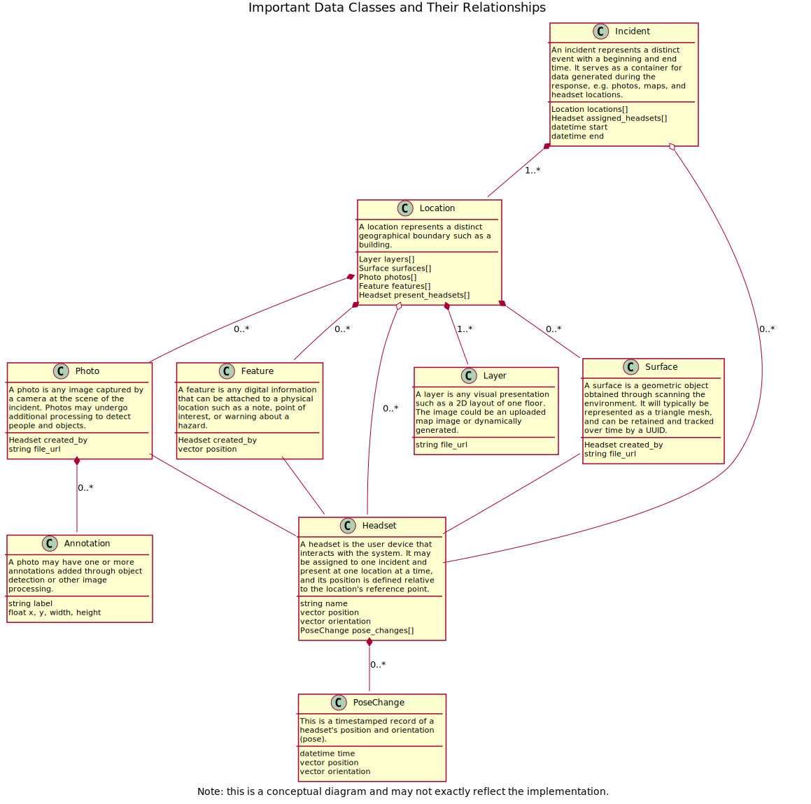

# edge-server

This module coordinates interactions between multiple AR headsets, collects map and position changes from them, and disseminates important updates to all of the headsets. The primary functionality is exposed through an HTTP-based API and web interface, as shown below. Other edge compute tasks like computer vision will probably go in a separate module. This module could use a more clever name.

AR headset <- HTTP -> edge-server <- HTTP -> App or web interface

# Setup

Install dependencies.

```console
python3 -m pip install -r requirements.txt
```

Run the server with default settings. By default, it will listen on localhost port 5000 and look in the running directory for data and configuration files.

```console
python3 -m server
```

Run all of the unit tests with coverage report.

```console
python3 -m pytest --cov=server --cov-report term-missing:skip-covered
```

Alternatively, build and run using Docker.

```console
docker build -t vizar-edge-server .
docker run --rm -p 5000:5000/tcp --name vizar-edge-server vizar-edge-server
```

# Design



# API

One function for the edge server is to provide a central exchange point for collaboration between multiple headset users. Therefore, the edge API will be consumed by a variety of applications including code running on the AR headset, a web interface, and even an Android app.

The latest version of the API specification can be found [here](https://easyvizar.github.io/edge-server/apispec.html). This document is automatically produced from comments in the code by using the apispec library.

To the extent it is reasonable, we plan to adhere to the [REST API design principles](https://docs.microsoft.com/en-us/azure/architecture/best-practices/api-design).

## Position of Features in AR

Here a few ways the API can specify the position of map features (points, symbols, or polygons) to be displayed in AR.

* Floating placement – a number of pixels or percentage from the top, bottom, left, or right of the screen
* Surface placement – on a floor or wall surface, centered or placed at an offset from the edge of the surface
* Point placement – a marker placed at a specified coordinate in space either relative to the headset or in a global coordinate system
